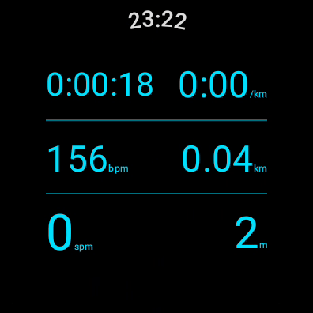
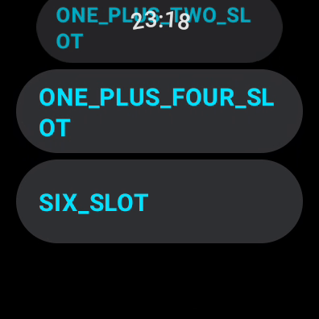
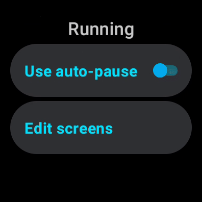
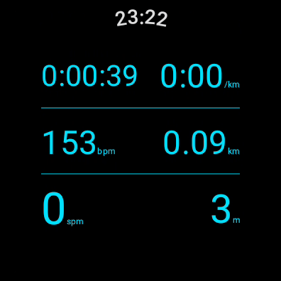
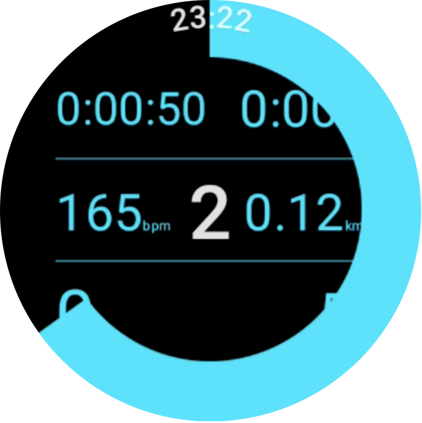

# Tempo

Experimental app for learning about [Health Services][health-services] and [Wear Compose][wear-compose]

Things that this tries to explore:

## Pager for different screens

During the workout, the user is able to either swipe or use crown/bezel to move between different screens containing different metrics.

## Configurable screen options

Each screen can be configured in two ways:

1.  The number and arrangement of metrics on the screen. This can range from a single metric in the centre of the screen, through a range of options, through to six separate metrics on the screen.

1.  The specific metrics to be shown can be configured by the user, chosen from the list of data types supported by the device.

## Avoiding small tap targets

Pause/resume is via a double-tap to the screen; Finishing workout is through a long press. No small buttons on-screen.

## TODO

There's lots still to explore, lots to improve. Certainly very rough round the edges.

[health-services]: https://developer.android.com/training/wearables/health-services
[wear-compose]: https://developer.android.com/training/wearables/compose